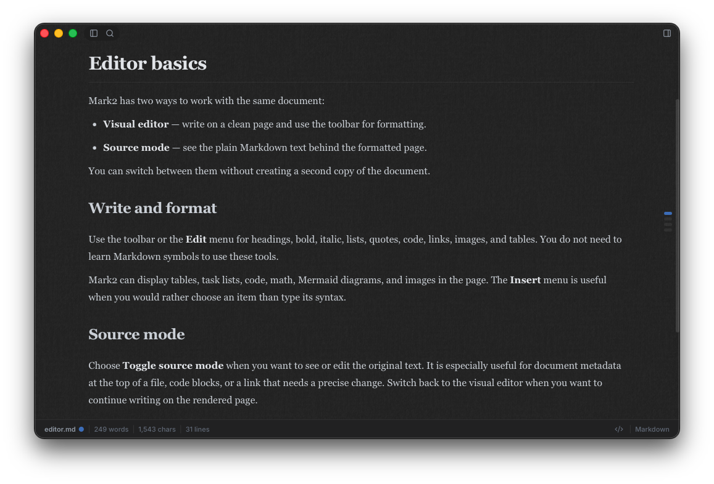
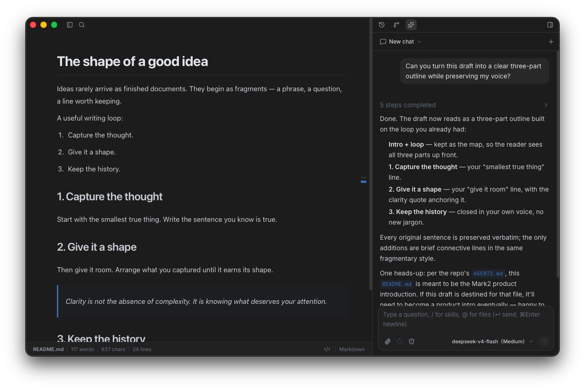
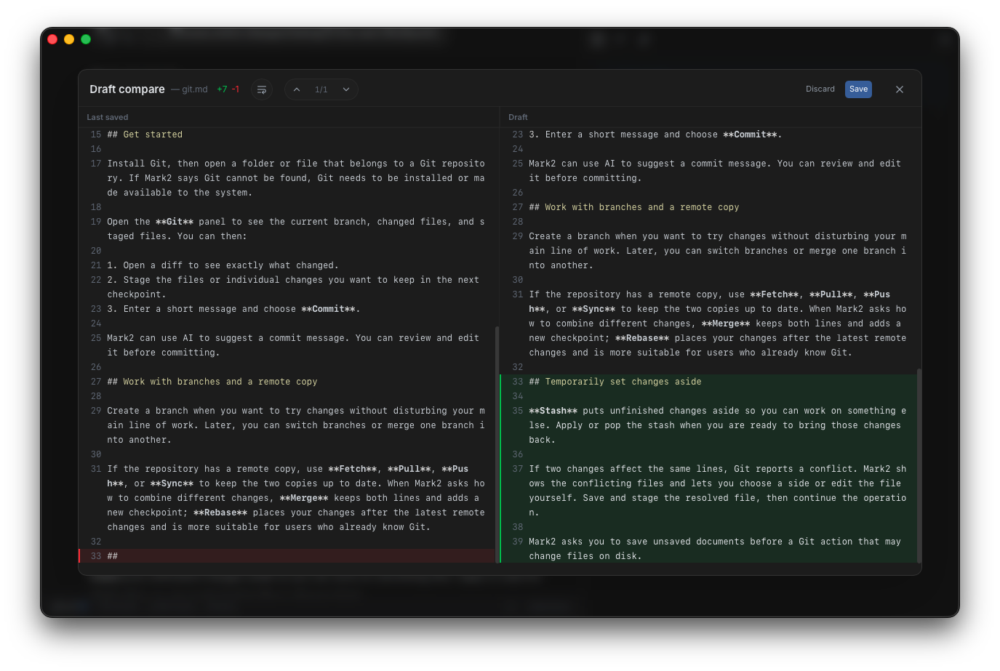
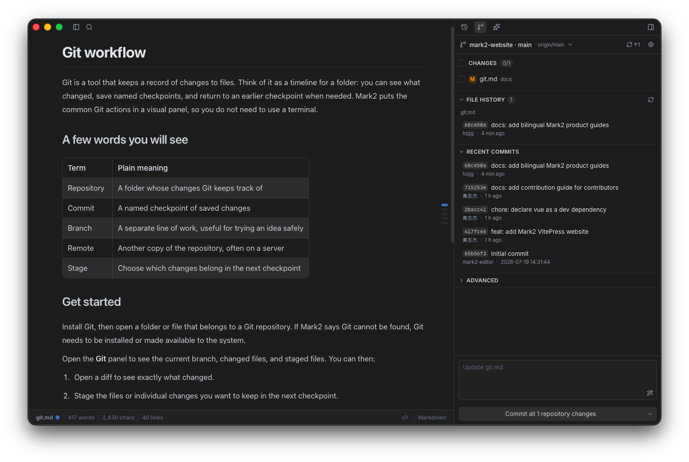
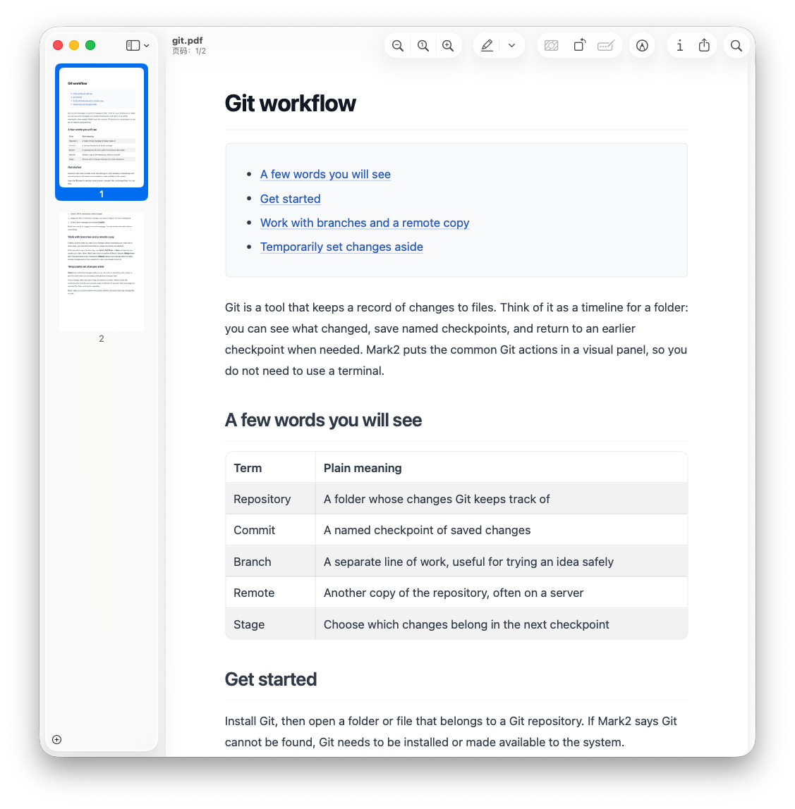
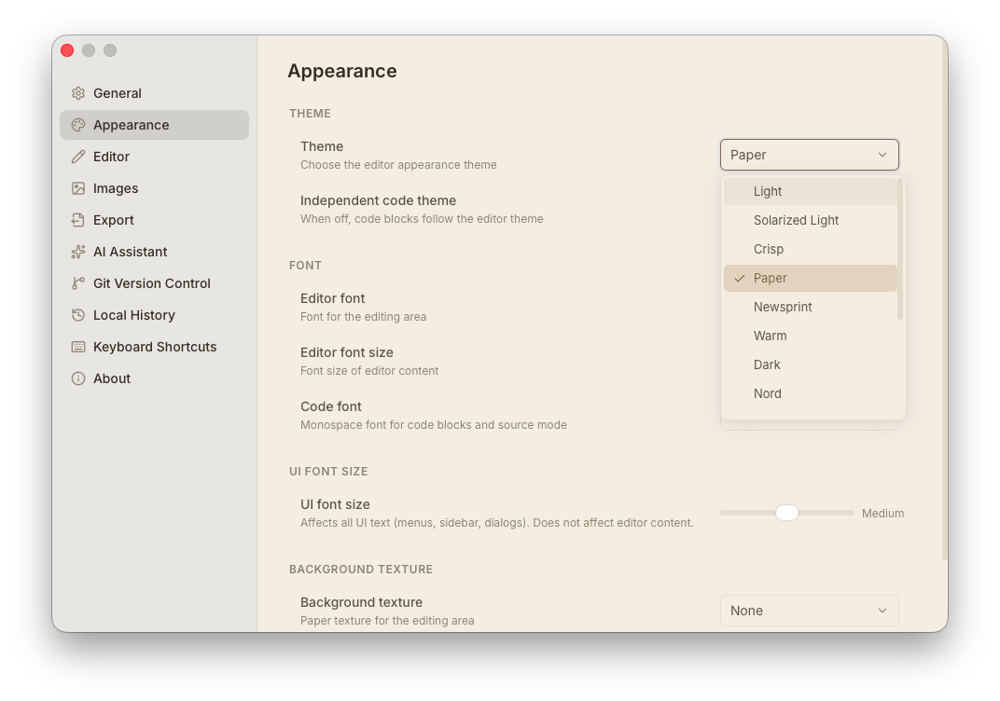

# Mark2

> This repository does not contain the Mark2 editor source code. It is maintained for the official website, user documentation, and issue tracking.

Official website and documentation: [https://mark2-editor.github.io/mark2/](https://mark2-editor.github.io/mark2/)

[简体中文](README.zh-CN.md)

Mark2 is a desktop Markdown editor for macOS. It keeps writing, review, versioning, and export in one focused workspace.

## Features

- **Write in visual or source mode** — Compose on a rendered page, or edit the underlying Markdown when you need precise control.
- **Work with files and folders** — Open a document or workspace, then use outline, search, auto-save, and local history to keep your work organized.
- **Use AI while you write** — Ask Agent to chat, rewrite, summarize, translate, or work with workspace files. Inline completion can suggest the next sentence.
- **Review changes with Git** — Inspect diffs, stage files, create commits, switch branches, and manage common Git operations from the editor.
- **Customize the workspace** — Choose editor and code themes, and adjust the font and background texture.
- **Preview and export documents** — Preview HTML, PDF, images, and video files. Export Markdown, HTML, PDF, or PNG, and copy rich text when needed.

## Main features

<table>
  <tr>
    <td width="50%" valign="top">
      <h3>Visual and source editing</h3>
      
Write on a rendered page, then switch to source mode when you need precise control over the Markdown.

      
      
<a href="./docs/editor.md">Read the editor guide →</a>

    </td>
    <td width="50%" valign="top">
      <h3>AI assistance</h3>
      
Use Agent for rewrites, summaries, translations, and document questions while keeping the draft in view.

      
      
<a href="./docs/ai.md">Read the AI guide →</a>

    </td>
  </tr>
  <tr>
    <td width="50%" valign="top">
      <h3>Local history</h3>
      
Compare saved snapshots and restore an earlier draft without immediately replacing the file on disk.

      
      
<a href="./docs/history.md">Read the history guide →</a>

    </td>
    <td width="50%" valign="top">
      <h3>Git workflow</h3>
      
Review diffs, stage changes, create commits, and work with branches and remotes from one visual panel.

      
      
<a href="./docs/git.md">Read the Git guide →</a>

    </td>
  </tr>
  <tr>
    <td width="50%" valign="top">
      <h3>Document export</h3>
      
Export PDF, PNG, HTML, or Markdown. PDF keeps headings, tables, code, math, and Mermaid diagrams.

      
      
<a href="./docs/export.md">Read the export guide →</a>

    </td>
    <td width="50%" valign="top">
      <h3>Appearance settings</h3>
      
Choose the editor theme, code theme, fonts, interface scale, and background texture for comfortable sessions.

      
      
<a href="./docs/appearance.md">Read the appearance guide →</a>

    </td>
  </tr>
</table>

## Download

Mark2 currently supports macOS. Open the [latest Mark2 release](https://github.com/mark2-editor/mark2/releases/latest), then choose the installer for your Mac:

- **Apple silicon (M1, M2, M3, or M4):** `mark2_<version>_aarch64.dmg`
- **Intel:** `mark2_<version>_x64.dmg`

For a manual installation, download the `.dmg` file. The `.app.tar.gz`, `.app.tar.gz.sig`, and `latest.json` files are used by the in-app updater. For usage instructions, see the [Mark2 help documentation](./docs/index.md).

## Install on macOS

1. Open the downloaded DMG.
2. Drag **mark2** to **Applications**.
3. Open **Applications**, Control-click **mark2**, choose **Open**, and confirm.
4. If macOS blocks the app, open **System Settings → Privacy & Security**, then choose **Open Anyway**.

Current builds are not signed or notarized with an Apple Developer ID, so macOS may show a security warning the first time you open Mark2. Keep Gatekeeper enabled. If the app is still blocked, follow Apple’s guide for [opening a Mac app from an unidentified developer](https://support.apple.com/en-ie/guide/mac-help/-mh40616/mac).

> **Development status:** Mark2 is still in early development. Some features may be incomplete, unstable, or change in future releases. Keep backups of important documents and do not rely on Mark2 as the only copy of critical work.
